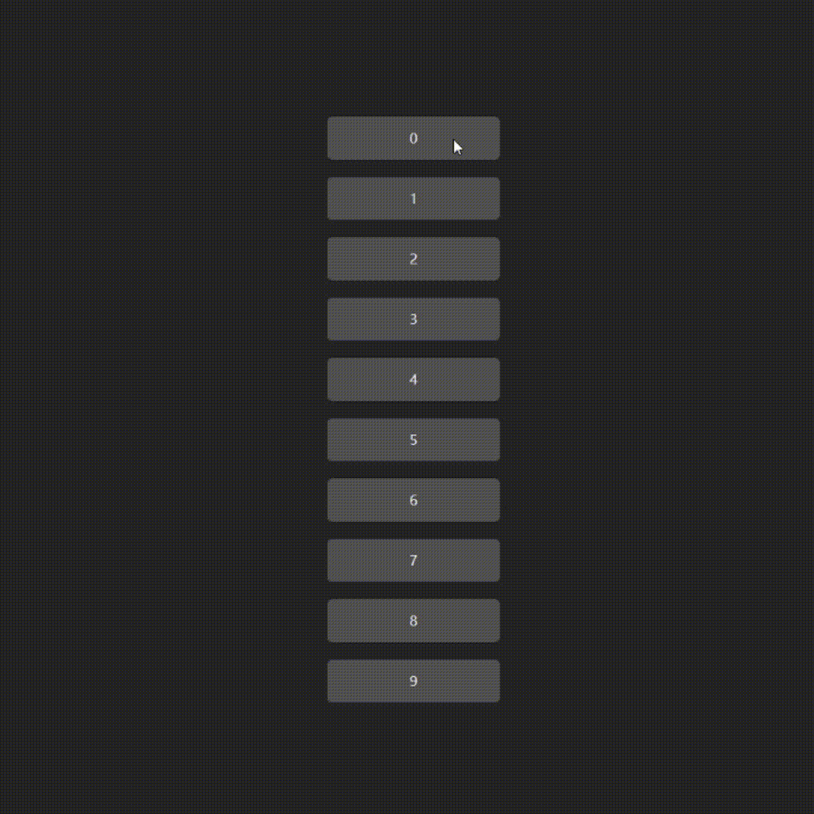

# DragAndDropChangeList - 拖拽改变列表顺序

## 🟥🟧🟨🟩🟦🟪🟫⬛⬜



## 🟥1、先来一个小长条！

```html
<div
  class="item"
  v-for="(i, index) in list"
  :key="i"
  draggable="true"
  @dragstart="dragstart(index)"
  @dragenter="dragenter(index)">
  {{ i }}
</div>
```
- `draggable="true"` 让这个 `div` 可以被拖动
- `@dragstart="dragstart(index)"` 模块被拖动时触发：传递 【被拖动的模块的 `index` 】 过去
- `@dragenter="dragenter(index)"` 当模块被拖入到这里时触发：传递 【被放入的模块的 `index` 】过去

css 👇 样式随便定

```css
.item {
  width: 100%;
  max-width: 200px;
  height: 50px;
  background-color: rgb(80, 80, 80);
  display: flex;
  justify-content: center;
  align-items: center;
  margin: 10px;
  border-radius: 6px;
}
```

js👇

```html
<script setup lang="ts">
import { ref } from "vue";

let list = ref([0, 1, 2, 3, 4, 5, 6, 7, 8, 9]); //列表

let in_index: any = null;  //入的index
let out_index: any = null; //放的index

//1.开始拖拽触发器
function dragstart(index: any) {
  console.log("拖拽开始！");
  in_index = index;
}

//2.拖拽进入👇
function dragenter(index: any) {
  out_index = index;
  if (in_index > out_index) {
    list.value.splice(out_index, 0, list.value[in_index]);
    list.value.splice(in_index + 1, 1);
  } else if (in_index < out_index) {
    list.value.splice(out_index + 1, 0, list.value[in_index]);
    list.value.splice(in_index, 1);
  }
  in_index = index;
}
</script>
```

## 🟪【END】

关于我：https://github.com/XXGGG  
项目地址：https://github.com/XXGGG/DEMO  
演示网址：https://xxggg.github.io/DEMO/DragAndDropChangeList
