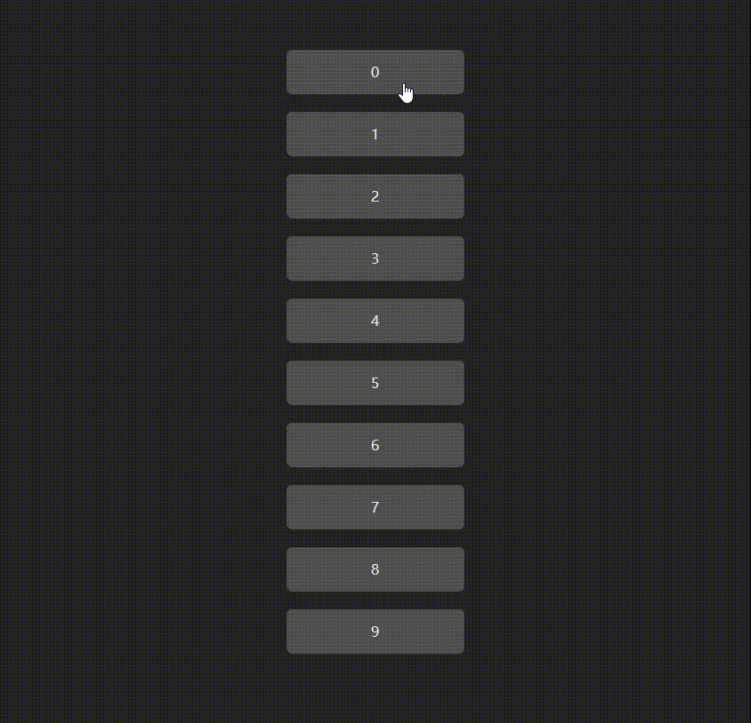

# DragAndDropChangeList2 - 拖拽改变列表顺序2

改进，在拖拽的过程中，把原来的“幽灵”图片替换了~ 👇
## 🟥🟧🟨🟩🟦🟪🟫⬛⬜



## 🟥
```js
import { ref } from "vue";

let list = ref([0, 1, 2, 3, 4, 5, 6, 7, 8, 9]);

let in_index: any = null;
let out_index: any = null;
let in_event: any = null;

let cloneObj: any = null; //克隆对象
let left: number;
let top: number;
let layerX:number //鼠标点击物体里面的方位
let layerY:number
//1.开始拖拽触发器
function dragstart(ev: any, index: any) {
  console.log("拖拽开始！");

  //先把原来的“幽灵图片”隐藏
  var img = new Image();
  img.src = "";
  ev.dataTransfer.setDragImage(img, 0, 0);

  //把拖拽时，原来的底图也暂时隐藏掉
  in_event.target.style.opacity = "0";

  //把当前 元素 给到大局
  in_event = ev;
  //把当前的index 给到大局
  in_index = index;

  //这里先拿到鼠标点进 元素里的坐标
  layerX = ev.layerX; //鼠标点击物体里面的方位
  layerY = ev.layerY;

  //用鼠标在浏览器窗口的坐标 减去 鼠标在元素里的坐标 = 元素偏移后对应鼠标当前位置在浏览器上的坐标
  left = ev.clientX - layerX;
  top = ev.clientY - layerY;
  
  //克隆节点！
  let el = ev.target;
  cloneObj = el.cloneNode(true);
  cloneObj.style =
    "position:fixed;left:0;top:0;z-index:999;pointer-events:none;transform:translate3d( " +
    left +
    "px ," +
    top +
    "px,0);";
  //生成这个节点出来，节点的偏移坐标，已经在上面 当前鼠标的位置 计算好了！
  document.body.appendChild(cloneObj);
}

//监听全局拖拽事件，同样计算好偏移。做到跟随鼠标！！
document.addEventListener("dragover", function (ev) {
  let left = ev.clientX - layerX;
  let top = ev.clientY - layerY;;
  if (cloneObj) {
    cloneObj.style.transform = "translate3d( " + left + "px ," + top + "px,0)";
  }
});
//监听，当拖拽结束后，就把生成的那个节点给删掉！！
document.addEventListener("dragend", function (ev) {
  document.body.removeChild(cloneObj);
  cloneObj = null;
});


//2.拖拽进入👇
function dragenter(ev: any, index: any) {
  out_index = index;
  if (in_index > out_index) {
    list.value.splice(out_index, 0, list.value[in_index]);
    list.value.splice(in_index + 1, 1);
  } else if (in_index < out_index) {
    list.value.splice(out_index + 1, 0, list.value[in_index]);
    list.value.splice(in_index, 1);
  }
  in_index = index;
}
let dragend = (event: any, index: any) => {
  //回复原节点元素的 显示状态！
  in_event.target.style.opacity = "1";
};

```


## 🟪【END】

关于我：https://github.com/XXGGG  
项目地址：https://github.com/XXGGG/DEMO  
演示网址：https://xxggg.github.io/DEMO/DragAndDropChangeList2
